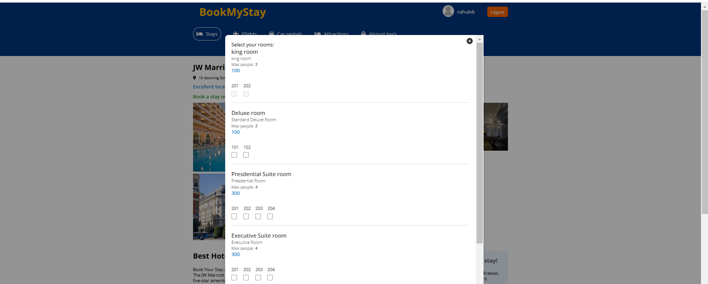

# 🌟 **Book My Stay** - Hotel Booking Website 🌟

Welcome to **Book My Stay**, a modern hotel booking platform built with the **MERN Stack** (MongoDB, Express, React, Node.js). This full-stack application allows users to search for hotels in various cities, explore different property types, and view featured hotels. Additionally, there is an **Admin Panel** that provides management features for administrators to view users and hotel listings.

🔗 **Visit the live website**: [Book My Stay](https://hotel-booking-mern-fullstack.onrender.com/)

---

## 🚀 **Features**

### 1. **Hotel Search**
- 🌍 **Search for Hotels**: Find the best hotels across various cities with detailed filters.
- 🔎 **Filter by Type & Location**: Easily filter hotels by location, type, and other criteria.
- 🏙️ **Explore Cities**: Discover hotels in the cities of your choice.

### 2. **Featured Properties**
- 🌟 **Featured Hotels**: On the main page, check out a selection of handpicked **Featured Hotels** that have been selected for you.
- 🏨 **Popular & Best Deals**: Stay updated with the best deals and the most popular accommodations.

### 3. **User Authentication**
- **User Profile**: When logged in, users will see their profile image. If the user does not have a profile image, a default placeholder (avatar.png) will be shown.
- **Login/Logout**: If a user is not logged in, the website will show options to "Register" or "Sign In". Once logged in, the user will only see a "Logout" option.

### 4. **Booking Process**
- **City-Based Hotel Listings**: The website dynamically displays hotel listings based on the selected city.
- **Filter by Price & Other Criteria**: The yellow filter bar allows users to filter hotels by Min Price, Max Price, Adults, Children, and Rooms.
- **Login Required for Booking**: If a user is not logged in and tries to access the "See Availability" button, they are redirected to the login page.
- **Dynamic Price Calculation**: Based on the selected check-in and check-out dates, the website calculates the price for the number of nights and shows the total price.
- **Room Availability**: The user can select rooms, and if a room is unavailable for the selected dates, the checkbox will be disabled.

### 5. **Admin Panel** 
- **Admin Access**: Authenticated users with admin rights can manage hotel data and users.
- **Manage Users & Hotels**: Admins can view the list of users and manage hotel details.
- **Note**: The Admin Panel is **still under development**, and the link will be added shortly.

[**Admin Panel**](#) *(Link to be added soon)*

---

## 🛠️ **Technology Stack**

- **Frontend**: React.js
- **Backend**: Node.js with Express.js
- **Database**: MongoDB
- **Authentication**: JWT (JSON Web Tokens)
- **Deployment**: Render (for backend) & Netlify (for frontend)

---

## 💡 **How It Works**

1. **Search for Hotels**: Enter your desired location on the homepage and explore a variety of hotels available.
2. **Explore Featured Properties**: Find hand-picked hotels that offer the best services and prices.
3. **Book Your Stay**: Select rooms, view pricing, and make bookings directly through the platform.

---

## 📸 **Screenshots**

Here are some images from **Book My Stay**:

### 1. **Landing Page**
In the landing page:
- If the user is logged in, their profile image will be displayed. If not, a placeholder avatar will be shown.
- If the user is logged out, options for "Register" and "Sign In" will be shown. Once logged in, only "Logout" will be displayed.


### 2. **Hotel Search Page**
On the Hotel Search Page:
- Users can filter hotels based on price, number of adults, children, and the number of rooms.
- If a user is not logged in and tries to check availability, they are redirected to the login page.


### 3. **Booking Page**
On the Booking Page:
- The website calculates the total price based on the number of nights selected.
- The yellow filter bar is functional for filtering hotels.
- The user can view room details and availability before booking.


### 4. **Select Room Page**
On the Select Room Page:
- Users can view available rooms with a checkbox next to each.
- If a room is available on the selected dates, users can select the checkbox to book it.
- If the room is unavailable on the selected dates, the checkbox will be disabled.



---

## 🚀 **Getting Started**

To run this project locally, follow these steps:

1. **Clone the repository**:
    ```bash
    git clone https://github.com/yourusername/book-my-stay.git
    ```

2. **Navigate to the frontend directory**:
    ```bash
    cd book-my-stay/client
    ```

3. **Install dependencies**:
    ```bash
    npm install
    ```

4. **Start the frontend**:
    ```bash
    npm start
    ```

5. **Navigate to the backend directory**:
    ```bash
    cd ../api
    ```

6. **Install dependencies**:
    ```bash
    npm install
    ```

7. **Start the backend**:
    ```bash
    npm start
    ```

---

## 👥 **Contributing**

We welcome contributions from the community! If you'd like to contribute to **Book My Stay**, please fork the repository, make changes, and submit a pull request. Together, we can make this platform even better!

---

## 📜 **License**

This project is licensed under the MIT License - see the [LICENSE.md](LICENSE.md) file for details.
