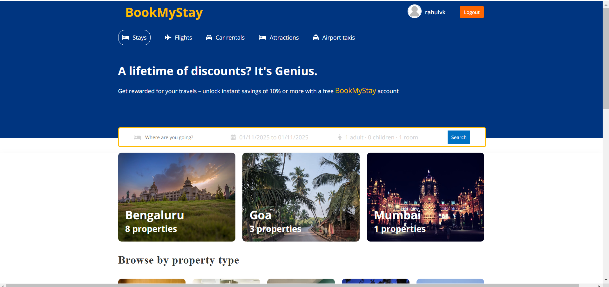
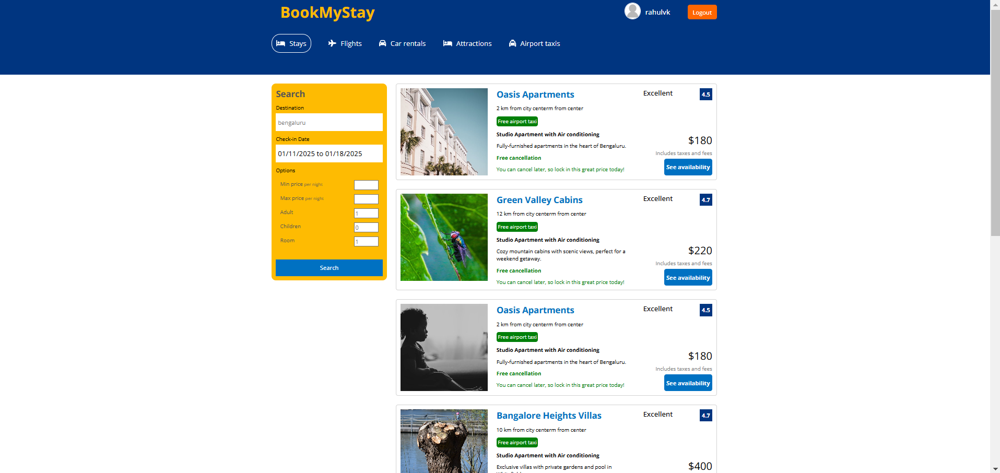
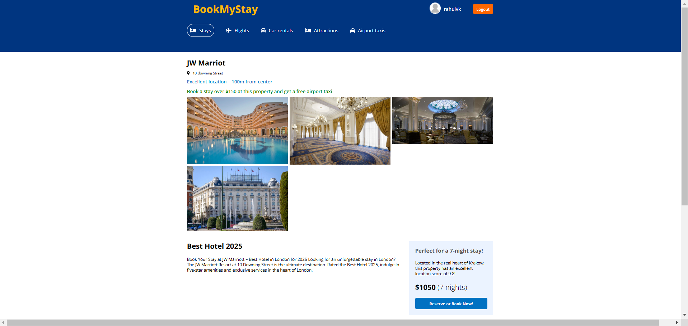

# 🌟 **Book My Stay** - Hotel Booking Website 🌟

Welcome to **Book My Stay**, a modern hotel booking platform built with the **MERN Stack** (MongoDB, Express, React, Node.js). This full-stack application allows users to search for hotels in various cities, explore different property types, and view featured hotels. Additionally, there is an **Admin Panel** that provides management features for administrators to view users and hotel listings.

🔗 **Visit the live website**: [Book My Stay](https://hotel-booking-mern-fullstack.onrender.com/)

---

## 🚀 **Features**

### 1. **Hotel Search**
- 🌍 **Search for Hotels**: Find the best hotels across various cities with detailed filters.
- 🔎 **Filter by Type & Location**: Easily filter hotels by location, type, and other criteria.
- 🏙️ **Explore Cities**: Discover hotels in the cities of your choice.

### 2. **Featured Properties**
- 🌟 **Featured Hotels**: On the main page, check out a selection of handpicked **Featured Hotels** that have been selected for you.
- 🏨 **Popular & Best Deals**: Stay updated with the best deals and the most popular accommodations.

### 3. **Admin Panel** 
- **Admin Access**: Authenticated users with admin rights can manage hotel data and users.
- **Manage Users & Hotels**: Admins can view the list of users and manage hotel details.
- **Note**: The Admin Panel is **still under development**, and the link will be added shortly.

[**Admin Panel**](#) *(Link to be added soon)*

---

## 🛠️ **Technology Stack**

- **Frontend**: React.js
- **Backend**: Node.js with Express.js
- **Database**: MongoDB
- **Authentication**: JWT (JSON Web Tokens)
- **Deployment**: Render (for backend) & Netlify (for frontend)

---

## 💡 **How It Works**

1. **Search for Hotels**: Enter your desired location on the homepage and explore a variety of hotels available.
2. **Explore Featured Properties**: Find hand-picked hotels that offer the best services and prices.
3. **Book Your Stay**: Select rooms, view pricing, and make bookings directly through the platform.

---

## 📸 **Screenshots**

Here are some images from **Book My Stay**:

### 1. **Landing Page**


### 2. **Hotel Search Page**


### 3. **Booking Page**


*Note: You can replace these image URLs with your actual images to show off the beauty of the application.*

---

## 🚀 **Getting Started**

To run this project locally, follow these steps:

1. **Clone the repository**:
    ```bash
    git clone https://github.com/yourusername/book-my-stay.git
    ```

2. **Navigate to the frontend directory**:
    ```bash
    cd book-my-stay/client
    ```

3. **Install dependencies**:
    ```bash
    npm install
    ```

4. **Start the frontend**:
    ```bash
    npm start
    ```

5. **Navigate to the backend directory**:
    ```bash
    cd ../api
    ```

6. **Install dependencies**:
    ```bash
    npm install
    ```

7. **Start the backend**:
    ```bash
    npm start
    ```

---

## 👥 **Contributing**

We welcome contributions from the community! If you'd like to contribute to **Book My Stay**, please fork the repository, make changes, and submit a pull request. Together, we can make this platform even better!

---

